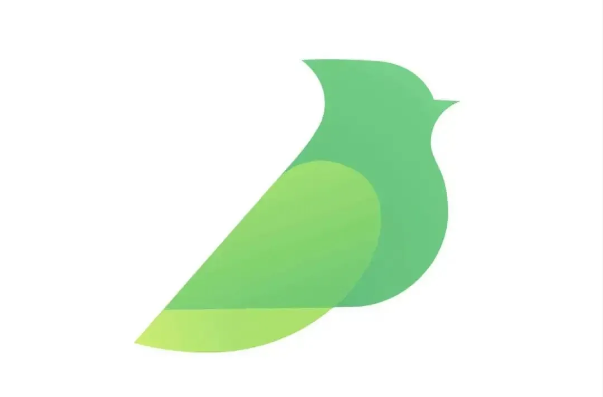

<!--   my-ticker -->    
  

    
                                      
                                        
## 前端工程师—猫吃清蒸鱼  

热爱前端、热爱技术。目前是大三学生正在实习中，努力沉淀中

### **社交主页：**

 

-   <a href="https://www.yuque.com/zoeblog"><code></code></a>:目前在语雀写博客，欢迎大家一起学习👯

### **技术栈:**

<a href="https://reactjs.org/"><code></code></a>
<a href="https://www.tslang.cn/index.html"><code></code></a>
<a href="https://webpack.js.org/"><code></code></a>
<a href="https://cn.vitejs.dev"><code></code></a>
<a href="https://tailwindcss.com"><code></code></a>
<a href="https://www.docker.com"><code></code></a>

### 📈 GitHub Activity Graph:
<!--  -->

